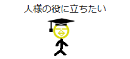

# 第51回：正确的努力

[原文链接](https://wa3.i-3-i.info/column51.html)

今天是2020年7月7日，是七夕节。七夕节的节日食品是什么来着？查了一下是挂面。最近我每天都在吃这个（－。－;）。言归正传，欢迎阅读超不定期连载的《好像懂了，不懂也懂了的 IT 专栏》！在这里，我会以 IT 相关的话题为主题，啰啰嗦嗦地讲一些我想到的事情。我会为了让大家发出“啊，虽然觉得好像很有用，但是也没用啊。但是，说不定会有用呢”这样的感叹而努力!

## 首先

第51回的主题乃......（锵锵~）

**正确的努力**

是也。

经常听到别人说“努力固然很重要，但是如果是错误的努力，一直坚持下去也没用”，对吧？

这一回我就是想写写我对这种观点的思考。总结为以下几点：

1. ***光想“这是不是正确的努力啊？”是白费功夫。***
2. ***要事先设定好“撤退”的条件。***
3. ***不要沉醉于正在努力的自己。***

## “正确的努力”的定义

什么样的努力才叫“正确的努力”？

其实每个人的理解都可以不同，可以有各种各样的定义。在这一回的专栏里，我把“正确的努力”定义为“**会导向成果的努力**”，以进行后边的讨论。

比如，为了考试合格而学习。如果坚持“学习”，就一定会离“考试合格”越来越近，那么这种努力就是“正确的努力”。

## 有了成果，才能判断是不是“正确的努力”

啾啾太郎突然出现！

（你好~）

啾啾太郎制作可在线阅读的 IT 用语辞典！

（啪啪敲键盘）

啾啾太郎心想，如果有很多人觉得自己制作的 IT 用语辞典很有用的话就太好了。

（希望能对别人有用）

它还心想，如果广告收入咔咔入账那就太好了。

（还想要钱）

但是来看 IT 用语辞典的人并没有那么多，广告收入也寥寥无几。

（访问量好少）

但是，啾啾太郎没有放弃，努力改良着 IT 用语辞典。

增加用语条目，尝试登载专栏之类的东西。

（啪啪敲键盘）

就这样持续努力了一整年。

结果！

很遗憾，来看的人，并没有增加很多。

啾啾太郎有点泪目。

（要哭惹）

在这里，请思考一下。

啾啾太郎为了达到“帮到很多人”、“广告收入咔咔入账”这两个目标而努力。努力了一整年，没有成果。

啾啾太郎这一整年的努力，是**不会导向成果的努力**（即错误的努力）吗？

答案是：**不知道**。因为有可能努力的方向是对的，只不过量还不够，所以目前还没有成果。

明明努力了但没有成果，有两种可能：

1. 之前的努力，是**不会导向成果的努力**（即错误的努力）
2. 之前的努力，是**会导向成果的努力**（即正确的努力）

**只有成果出来了，我们才能判断出，之前的努力是正确的努力**。**如果目前成果还没出来，那么我们并不能断言之前的努力是错误的努力**。**因为确实有“努力的方向是对的，只不过量还不够”这种可能性**。

所以，在成果还没出来的时候，老是想着“我现在的努力是不是正确的努力/错误的努力啊？”，是白费功夫。这问题是想不出结果的，想这些只会让心中的不安持续膨胀，一点儿好处也没有。

此乃

***光想“这是不是正确的努力啊？”是白费功夫***

是也。

## 近似的判断

在上一节讲了***光想“这是不是正确的努力啊？”是白费功夫***。

但是，果然还是很在意“我现在的努力是正确的努力，还是错误的努力？”，对吧？坚持不会导向成果的努力，那只是浪费时间而已。如果按现在的方向走下去，并不能得到成果，那么就应该快点转换方向。

的确如此。这样想来，分辨“正确的努力”和“错误的努力”是非常重要的。但是，分辨“正确的努力”和“错误的努力”的方法是不存在的。那咋办嘛。

从这种困境中麻利地脱身的方法，乃

 ***事先设定好“撤退”的条件***

是也。

通过事先设定好“撤退”的条件，就可以近似地分辨“正确的努力”和“错误的努力”，并且可以抑制这两种东西：

1. 对自己现在的做法的迷茫与不安（自卑）
2. 对未来的没有根据的乐观估计（自负）

虽然用的词是“撤退”，但我并不是推荐“放弃”。我的意思是**要事先设定好“重新审视和研究自己的做法”的时机**

也就是要预先设定好“目前做到这里没有成果，所以我判断从过去到现在为止的努力是错误的努力（虽然不知道真相是否如此）”的时机。

比如说，为了考取某个证书而学习。

学习方法是“一心地做往年真题”。

撤退条件设定为“接下来的三次考试都不合格”。

于是一心地做往年真题。

第一次考试不合格。

于是继续一心地做往年真题。

第二次考试不合格。

还是继续一心地做往年真题。

第三次考试不合格。

第三次考试不合格时，就判断“一心地做往年真题”是“错误的努力”。即便它有可能是“正确的努力”，只是量还不够，那也一样。

然后，就放弃考取那个证书。

......啊这，只是选项之一啦。还有去报班学习，向专业的老师请教之类的转变学习方法的选项。

顺带一提，撤退条件是要按照自己的实际情况设定的（译者注：假如考试是一年才有一次，那么要验证“接下来的三次考试都不合格”是否会发生就可能要等到三年之后，这显然不太合适）。设定“一个星期后的模拟考试没达到80分”这样的撤退条件当然也可以。要按照自己的判断来。

预先想好了撤退条件，就能减轻“一心地做往年真题的学习方式，难道是错误的吗？”这种中途产生的的迷茫和不安。

在“接下来的三次考试都不合格”之前，某一次考试合格了，那么自己这段时间的努力就是“正确的努力”。

“接下来的三次考试都不合格”发生了，那么自己这段时间的努力就是“错误的努力”。

是“正确的努力”还是“错误的努力”，看结果就知道了。

反过来说，没看到结果，就还不能做判断。不管脑子里想多久，也是想不出结论的。想这些只是在浪费时间。

而且，通过事先设定好撤退条件，可以排除“虽然成果还没有出来，但做法应该没有错吧”这种对未来的没有根据的乐观估计。不要忘了还有把“错误的努力”当成了“正确的努力”的可能性。如果事先确定了撤退条件，就可以避开这种情况。因为只要努力没有取得成果、满足了撤退条件，那么就会被判定为“错误的努力”。

**本来在没有成果的阶段，不能判断是“正确的努力”还是“错误的努力”，但是通过事先决定撤退条件，就可以进行近似的判断了。**

## 努力是过程

我认为，**过于注意“努力”本身是不好的**。

努力是得到某些东西的过程。

努力不是目的。努力的结果，即得到某些东西，才是目的。

比如说，你每天学习编程大约一小时。今天也努力学习了。

这样努力学习了一个月。好努力啊。

为什么？

你为什么在学习编程？

因为编程有趣？因为要找工作？因为编程的工作在家也能做，因为做编程的工作比较容易成为自由职业者，因为做编程的工作能挣很多钱？

你应该不是因为目的是“每天学习编程”才每天学习编程的吧。你一定是有“想做怎样怎样的事情”，“想成为怎样怎样的人”之类的目的。

请不要忘记那个“想做怎样怎样的事情”，“想成为怎样怎样的人”。

“努力”也可以当作借口来用。“我这么努力”也可能成为正当化自己的行为、逃避现实的方便借口。

但是，不能这样麻痹自己。

事实是，努力不是目的，努力然后得到某些东西才是目的。

## 总结

这回的专栏讲了一些关于“正确的努力”的事情：

1. 光想“这是不是正确的努力啊？”是白费功夫。
2. 要事先设定好“撤退”的条件。
3. 不要沉醉于正在努力的自己。

有了成果，才能判断是不是“正确的努力”

如果成果还没出来，那么有两种可能

1. 正在进行的是不会导向成果的努力（即错误的努力）
2. 正在进行的是会导向成果的努力（即正确的努力），只是努力的量还不够

所以成果还没出来时，其实无法真正分辨“正确的努力”与“错误的努力”。

但是，如果一直进行“错误的努力”就糟了。所以要通过事先设定好撤退条件，来近似地分辨“正确的努力”与“错误的”努力。

如果在满足撤退条件之前，成果就出来了，那么就应当判断为“正确的努力”。如果在成果出来之前，满足了撤退条件，那么就应当判断为“错误的努力”。

还有，努力是过程。努力不是目的，努力然后得到某些东西才是目的。不要沉醉于正在努力的自己。

## 画蛇添足的结尾

这回提到的“事先设定好‘撤退’条件”的方法，在很多事情上都可以应用。

比如，我现在是自由职业，我给自己设定了这样的规则：

- 存款在〇〇元以上：不想接的工作就不接
- 存款在△△元以上，〇〇元以下：不想接的工作也接
- 存款不到△△元：放弃自由职业，去公司就职

因为设定好了撤退条件，所以即使发生了这次新冠疫情一样的变故，“怎么办呀，继续做自由职业还能行吗（´・ω・`）”这样的不安感也会减轻很多。

不管新冠疫情发展成怎样了，只要存款没有跌破〇〇元，我就按照自己的喜好来接工作。如果存款跌破△△元，那么不管是受新冠疫情影响还是别的什么影响，我都会去找工作。

如果事先就在心里决定好“如果那样的话，就怎么怎么做”，那么外部原因造成的内心动摇就会减少。我挺推荐这个方法的。

这回的《好像懂了，不懂也懂了的 IT 专栏》就到这里了，您觉得怎么样呢。以后有新的想法的话，会一点点更新的。下次也请您关照了。

（辛苦了，感谢您的阅读）