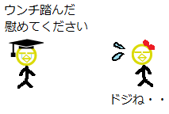
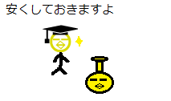

# 第52回：让运气变好的方法

[原文链接](https://wa3.i-3-i.info/column52.html)

今天是2020年7月28日。本来想进入8月再写，但不知道干劲能保持到什么时候，所以决定赶紧写出来。言归正传，欢迎阅读超不定期连载的《好像懂了，不懂也懂了的 IT 专栏》！在这里，我会以 IT 相关的话题为主题，啰啰嗦嗦地讲一些我想到的事情。我会为了让大家发出“啊，虽然觉得好像很有用，但是也没用啊。但是，说不定会有用呢”这样的感叹而努力!

## 首先

第52回的主题乃......（锵锵~）

**让运气变好的方法**

是也。

果然又是和 IT 没啥关系的主题呢，Don't mind！

......这句话都快成惯例了。

Don't mind！

这回的专栏的结论是：

1. ***意识到到自己的运气很好。***
2. ***覆盖倒霉的事件。***
3. ***播下幸运的种子。***

## 意识到到自己的运气很好

首先想让各位注意到的事情就是，**对运气好坏的评价是相对的**。

还有，**大家的运气很好**。

为什么这么说？因为各位与我正在写的这个超棒的专栏相遇了啊！

（耶~）

......当然是开玩笑的。

正在读这篇文章的你，现在在使用网络对吧？

也就是说，你“至少有上网的空闲时间”对吧？

既不是在失去意识的状态下住院，也不是正在逃离杀人魔的魔爪，也不是在远离文明的无人岛上。

当然每个人都有自己各种各样的情况。但至少，此时此刻你是个有时间上网的人。

你不觉得这是一件相当幸运的事情吗?

如果，你是在日本生活的日本人，那运气简直更好了。不用担心突然被枪击，拧开水龙头的话水就会出来，人权得到一定程度的保障。还有很多其他的好处。（译者注：在中国也一样。）

觉得自己运气不好的人，很可能符合这样的描述：

1. **经常把自己与（看上去似乎）身上在发生好事的人做对比**
2. **觉得一般来说应该发生更好的事情**

比如说，你买了100张彩票，只中了1万日元。

如果你周围有买了1张彩票就中了10万日元的人，那就会感觉自己运气不好吧。

而如果你周围尽是买了100张才中3000日元的人，那就会感觉自己才是幸运的。

经常把自己与（看上去似乎）身上在发生好事的人做对比，当然就会感觉自己运气不好了。

此乃

**经常把自己与（看上去似乎）身上在发生好事的人做对比**

是也。

接下来讲讲

**觉得一般来说应该发生更好的事情**

这种情况。

因为有了“一般来说，应该会发生更好的事情”这种想法，所以才会觉得“我身上没有发生那样的好事，所以运气不好”。

但是，那个“一般来说”真的一般吗？

比如说，我收到了1000日元的压岁钱。

如果心想“一般是500日元左右吧”，就会觉得“能拿到1000日元！运气真不错！”。

而如果心想“一般是5000日元左右吧”，那就会觉得“只拿到了1000日元，运气真不好啊”。

同样是1000日元的压岁钱，如果心中所想的“一般来说”不同，那么对自己运气的评价也就不同。如果平时经常觉得自己“运气不好”，那么可能是对“一般”的期待值过高了。

此乃

**觉得一般来说应该发生更好的事情**

是也。

但是，希望大家不要误解，我想说的并不是“有比自己更困难的人，所以讨厌的事情也都给我忍着！”，也不是“降低期待值，给我感谢已有的一切！”

我想说的只是**对运气好坏的评价是相对的**。

发生同样的事，有些人觉得自己运气好，也有人觉得是运气不好。对运气的评价，是由当事人自己的认识来决定的。

## 覆盖倒霉的事件

读到这里，肯定会有人说：“我才不想听那种诡辩！我想知道的是，让更 Happy 的事情发生的方法！”。

好吧。

那我就告诉你，让更 Happy 的事情发生的方法。

那就是......其实已经在这一节的标题暴露了......

**覆盖倒霉的事件**

是也。

比如说，啾啾太郎散步的时候，踩到了狗屎。

（啪唧......啊！）

沾到了狗屎，是运气不好的事吧。

但是，不愧是啾啾太郎，他跑到啾啾子（女朋友）那里说“我踩到狗屎了，心情很沮丧，所以安慰我一下嘛”。

（踩到狗屎了，求安慰）（啊这......）

啾啾子觉得啾啾太郎可怜，就决定和他去蛋糕店约会。（不过蛋糕的费用嘛，是由啾啾太郎承担）

（去吃蛋糕不？）（去！好耶！）

感觉如何呢。

啾啾太郎把“踩到了狗屎”这件倒霉的事，变成了“和啾啾子去蛋糕店约会”的诱因。

啾啾太郎“踩到了狗屎”，这才引起了后续的“和啾啾子去蛋糕店约会”这件事。

啾啾太郎在心中已经不认为“踩到了狗屎”是倒霉的事。

此乃

**覆盖倒霉的事件**

是也。

我有一个这样的座右铭：

**如果摔倒了，要拾点东西再爬起来**。

摔倒的话，很疼。如果就这样站起来的话，那没有得到什么好处。那受的痛苦就是我的损失。

所以，我固执地一定要捡点什么。如果捡到了点什么，那就可以想“摔倒的痛苦，就是为了捡到这个而付出的成本嘛”。

对倒霉的事情也一样。如果以“啊~真倒霉啊”结束的话，那么这件事就真的很倒霉。

请把这件事作为诱因，和 Happy 的事情联系在一起吧。“写在博客里”，“在聚会的时候当作段子说出来”，“当作买那个一直想要但是因为价格很贵所以忍着没买的东西的理由”等等，怎样都可以。

绝对，绝对，绝对，要和 Happy 的事情联系在一起。如果坚持这么做，那么当倒霉的事情发生，就没有时间感叹“啊~运气真差啊”，而是忙着考虑“怎么做才能把这件事和 Happy 的事情联系在一起？”。

坚持这么做的结果，就是你周围的“倒霉的事”消失了。因为倒霉的事与 Happy 的事情联系在一起，总的来看就不感觉倒霉了。

身上不会发生倒霉的事的人，不就被称作“运气好的人”吗？

## 播下幸运的种子

上一节说了“消除倒霉的事的方法”。这一节要说的是“让幸运的事情发生的方法”。

让幸运的事情发生的方法！

那就是！

没有的（－A－）

对于心脏扑通扑通，心中期待着“让幸运的事情发生的方法是怎样的啊？”读到这里的人，建议平时注意不要买什么怪异的壶。（译者注：怪异的壶是指迷信的物品。）

（便宜点给你咯~）

这是当然的吧。

只要想一想“好，现在让幸运的事情发生吧！”，就真的会发生，那不就成神啦。在地面上爬的人类，哪能奢望那种事情。

但是，“让幸运的事情发生的可能性增大”的方法，是有的。

那就是**打不准的炮，多打也能打中**战略。

......总感觉好难听，果然还是改下名字吧，就改成**播下幸运的种子**战略吧。

所谓“播下幸运的种子”，就是**进行可能与幸运的事有联系的行为**。

啊，我想说的可不是“应该把什么什么颜色的物品戴在身上”或者“风水上应该怎样怎样做”，请不要误解了。什么风水、神佛、宇宙的能量、其他的这个那个，都和这回的专栏毫无关系。了解我的人都知道，我是“除了肚子痛的时候之外绝不求神派”。

言归正传。比如说，“亲切地对待周围的人”吧。

如果亲切地对待周围的人，那么自己有困难的时候就可能会得到帮助。比如，亲切地对待职场上的同事，那么加班的时候就可能收到从抽屉里拿出来的零食。当然也有可能什么都得不到。

亲切地对待周围的人使得幸运的事发生的可能性上升。就算什么也没发生，那也没事。因为种下的是“种子”，有开花结果的时候，也有不开花结果的时候。

如果有数播下的种子数量的空闲，那就赶快继续播种吧。尽量多播种，那么有种子开花结果的可能性就会上升。

还比如说“拼命学习”。因为拼命学习，所以知识增加了，人变得更可靠了。那么说不定在意想不到的地方就会出现感到你很有魅力的异性。

这样想来，“可能与幸运的事有联系的行为”不是有很多吗？

“元气满满地打招呼”、“捡掉在路边的垃圾”、“试着开始新的社团活动”都可能与幸运的事有联系。当然也有可能什么都不会发生。但是单纯地比较“元气满满地打招呼”的生活与“不元气满满地打招呼”的生活，还是在“元气满满地打招呼”的生活里更可能发生幸运的事，对吧？

确实没有变成运气好的人的方法。

我们人类能做到的，只有

**进行可能使幸运的事发生的概率增大的行为**

而已。

那么，怎样的行为会使幸运的事发生的概率增大呢？

就是你觉得“做这件事的话，感觉可能会发生什么好事诶”的行为。然后就是看你能做多少了。

## 总结

这回讲了一些关于“让运气变好的方法”的事情：

1. ***意识到到自己的运气很好。***
2. ***覆盖倒霉的事件。***
3. ***播下幸运的种子。***

首先应该做的是**意识到到自己的运气很好**。

在正在上网的此时此刻，你就是幸运的人。

无论在你周围发生了多么幸运的事，如果不能注意到“啊！我运气真好诶！”，那就无法成为“运气好的人”。因为**对运气好坏的评价是相对的**。

其次应该做的是**覆盖倒霉的事件**。

谁都会遇到觉得“运气真差啊”的事情。但是，就这样以“运气真差啊”结束是不行的。就算看起来很勉强，也要尽量和 Happy 的事情联系在一起。如果能做到这个，那么你身边的“倒霉的事”就会消失，就离“运气好的人”更近了一步。

最后应该做的是**播下幸运的种子**。

身为人类，没有直接让幸运的事发生的超能力，能做的只有**进行可能使幸运的事发生的概率增大的行为**。注意就算最后没有发生幸运的事也不要在意，因为种下的是“种子”，有开花结果的时候，也有不开花结果的时候。

那么以上就是这回专栏的（表面上的）总结。

以下是真心话的总结。

直白地说的话，这回的专栏想说的其实是**自我暗示，坚信“我的运气好”！**。

1. **意识到到自己的运气很好**

要做到这一点，也就是遇见小小的幸运，就暗示自己“运气很好”。

2. **覆盖倒霉的事件**

要做到这一点，也就是把本来倒霉的事情，自我暗示成“这不是倒霉的事情”，转移视线看向未来，缓和精神上的损失。

3. **播下幸运的种子**

要做到这一点，需要持续做一些可能会没有成果的努力。坚持做这样的事情肯定很难受，对吧。

但是要认识到“播种”就是这样的过程。即使一部分努力没有得到回报，如果能认识到到“哦，是播下的种子没有发芽呢，这种情况也是存在的”，那么转移去做下一件事就更容易。

坚信“自己的运气很好”的必要条件是

1. 增多感到幸运的机会
2. 减少感到倒霉的机会

为了达成这两条，则应当做

1. 意识到到自己的运气很好
2. 覆盖倒霉的事件
3. 播下幸运的种子

这三件事。

## 画蛇添足的结尾

实际上，世上也有运气好的如神明显灵般的人。简直像漫画的情节一样。

但是普通人想再现那个是不可能的。如果有空闲向神祈祷自己控制不了的事情，那还是在自己能控制的事情上多多加油吧。（－－）ノ

这回的《好像懂了，不懂也懂了的 IT 专栏》就到这里了，您觉得怎么样呢。以后有新的想法的话，会一点点更新的。下次也请您关照了。

（辛苦了，感谢您的阅读）