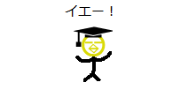
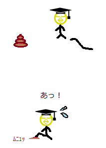

# 第52回：让运气变好的方法

[原文链接](https://wa3.i-3-i.info/column52.html)

今天是2020年7月28日。本来想进入8月再写，但不知道干劲能保持到什么时候，所以决定赶紧写出来。言归正传，欢迎阅读超不定期连载的《好像懂了，不懂也懂了的 IT 专栏》！在这里，我会以 IT 相关的话题为主题，啰啰嗦嗦地讲一些我想到的事情。我会为了让大家发出“啊，虽然觉得好像很有用，但是也没用啊。但是，说不定会有用呢”这样的感叹而努力!

作者简介：

佐佐木 真

1979年1月1日出生，男性。在英国出生，在日本长大。以系统开发为中心，在 IT 业界生存了10年以上，但依然对“横文字”和专业术语感到头疼（注：在日本，竖向是更传统的文字排版方向）。和同行沟通的时候心中总是暗骂“说人话！”，但自己好歹也算是“专业人士”，所以说不出口，一天天的尽过着这种日子。更详细的简历在[这里](https://i-3-i.info/index.html)。

译者简介：

派三叔iPython3

1998年出生，男性。在中国出生，在中国长大。在 IT 业界生存了......啊还没进入 IT 业界呢。

## 首先

第52回的主题乃......（锵锵~）

**让运气变好的方法**

是也。

果然又是和 IT 没啥关系的主题呢，Don't mind！

......这句话都快成惯例了。

Don't mind！

这回的专栏的结论是：

1. ***意识到到自己的运气很好。***
2. ***覆盖掉运气差的事件。***
3. ***播下幸运的种子。***

## 意识到到自己的运气很好

首先想让各位注意到的事情就是，**对运气好坏的评价是相对的**。

还有，**大家的运气很好**。

为什么这么说？因为各位与我正在写的这个超棒的专栏相遇了啊！

（耶~）

......当然是开玩笑的。

正在读这篇文章的你，现在在使用网络对吧？

也就是说，你“至少有上网的空闲时间”对吧？

既不是在失去意识的状态下住院，也不是正在逃离杀人魔的魔爪，也不是在远离文明的无人岛上。

当然每个人都有自己各种各样的情况。但至少，此时此刻你是个有时间上网的人。

你不觉得这是一件相当幸运的事情吗?

如果，你是在日本生活的日本人，那运气简直更好了。不用担心突然被枪击，拧开水龙头的话水就会出来，人权得到一定程度的保障。还有很多其他的好处。（译者注：在中国也一样。）

觉得自己运气不好的人，很可能符合这样的描述：

1. **经常把自己与（看上去似乎）身上在发生好事的人做对比**
2. **觉得一般来说应该发生更好的事情**

比如说，你买了100张彩票，只中了1万日元。

如果你周围有买了1张彩票就中了10万日元的人，那就会感觉自己运气不好吧。

而如果你周围尽是买了100张才中3000日元的人，那就会感觉自己才是幸运的。

经常把自己与（看上去似乎）身上在发生好事的人做对比，当然就会感觉自己运气不好了。

此乃

**经常把自己与（看上去似乎）身上在发生好事的人做对比**

是也。

接下来讲讲

**觉得一般来说应该发生更好的事情**

这种情况。

因为有了“一般来说，应该会发生更好的事情”这种想法，所以才会觉得“我身上没有发生那样的好事，所以运气不好”。

但是，那个“一般来说”真的一般吗？

比如说，我收到了1000日元的压岁钱。

如果心想“一般是500日元左右吧”，就会觉得“能拿到1000日元！运气真不错！”。

而如果心想“一般是5000日元左右吧”，那就会觉得“只拿到了1000日元，运气真不好啊”。

同样是1000日元的压岁钱，如果心中所想的“一般来说”不同，那么对自己运气的评价也就不同。

如果平时经常觉得自己“运气不好”，那么可能是对“一般”的期待值过高了。

此乃

**觉得一般来说应该发生更好的事情**

是也。

但是，希望大家不要误解，我想说的并不是“有比自己更困难的人，所以讨厌的事情也都给我忍着！”，也不是“降低期待值，给我感谢已有的一切！”

我想说的只是**对运气好坏的评价是相对的**。

发生同样的事，有些人觉得自己运气好，也有人觉得是运气不好。对运气的评价，是由当事人自己的认识来决定的。

## 覆盖掉运气差的事件

读到这里，肯定会有人说：“我才不想听那种诡辩！我想知道的是，让更 Happy 的事情发生的方法！”。

好吧。

那我就告诉你，让更 Happy 的事情发生的方法。

那就是......其实已经在这一节的标题暴露了......

**覆盖掉运气差的事件**

是也。

比如说，啾啾太郎散步的时候，踩到了狗屎。

（啪唧......啊！）

沾到了狗屎，是运气不好的事吧。

但是，不愧是啾啾太郎，他跑到啾啾子（女朋友）那里说“我踩到狗屎了，心情很沮丧，所以安慰我一下嘛”。

（踩到狗屎了，求安慰）（啊这......）

啾啾子觉得啾啾太郎可怜，就决定和他去蛋糕店约会。（不过蛋糕的费用嘛，是由啾啾太郎承担）

（去吃蛋糕不？）（去！好耶！）

感觉如何呢。

啾啾太郎把“踩到了狗屎”这件运气差的事，变成了“和啾啾子去蛋糕店约会”的契机。

啾啾太郎“踩到了狗屎”，这才引起了后续的“和啾啾子去蛋糕店约会”这件事。

啾啾太郎在心中已经不认为“踩到了狗屎”是运气差的事。

此乃

**覆盖掉运气差的事件**

是也。

我有一个这样的座右铭：

**如果摔倒了，要拾点东西再爬起来**。

摔倒的话，很疼。

如果就这样站起来的话，那没有得到什么好处。那受的痛苦就是我的损失。

所以，我固执地一定要捡点什么。

如果捡到了点什么，那就可以想“摔倒的痛苦，就是为了捡到这个而付出的成本嘛”。

对运气差的事情也一样。

「あ～、運が悪かったなぁ」で終われば、それで「運の悪い出来事」として確定してしまいます。
その出来事を呼び水にして、何が何でもハッピーな出来事につなげてください。
「ブログに書く」でも「飲み会でネタにする」でも「前から欲しかったけど高いから我慢していたアレを買うための自分に対する言い訳に使う」でも何でも構いません。

絶対に、絶対に、絶対に、ハッピーな出来事につなげるのです。
断固たる決意を持って、臨んでください。

これを徹底すると、運の悪い出来事が起きたときに「あ～、運が悪かったなぁ」なんて嘆いている余裕がなくなります。
「どうする？どうすればハッピーにつなげられる？」を考えることに大忙しだからです。

その結果、あなたの周りから「運の悪い出来事」がなくなります。
無理やりハッピーにつなげるので、トータルで見ると「運の悪い出来事」ではなくなるからです。

運の悪い出来事が起きない人は「運の良い人」と呼べるんじゃないですかね？

## 播下幸运的种子

さて、前の章で「運の悪い出来事をなくす方法」を書きました。
この章では「運が良い出来事を起こす方法」について書きます。

運が良い出来事を起こす方法！

それは！

ありません（－Ａ－）

「運が良い出来事を起こす方法って、どんなのだろう？ドキドキ」と期待しながら読んでしまった人は、怪しげな壺とかを買わないように気を付けてくださいね。

当たり前じゃないですか。
「よし、今からハッピーな出来事を起こすぜ！」と思って本当に起こせたら、そんなの神ですよ、神。
地べたを這いずる人間の分際で、そんなことを望んじゃいけません。

ただし、です。

運が良い出来事が起こる「可能性を上げる」方法ならあります。
それは

**「下手な鉄砲も数撃てば当たる」作戦**

です。

……なんかカッコ悪いので、やっぱり

**「幸運の種をまく」作戦**

に呼び名を変えます。

「幸運の種をまく」作戦、それは

**運が良い出来事につながるかもしれない行動を片っ端からやる**

作戦です。

あっ、ただし「〇〇色の物を身につける」とか「風水的にウンチャラなカンチャラをする」とかのやつではありませんからね。
誤解しないでくださいね。

風水も神仏も宇宙的エネルギーもその他のアレコレも今回のコラムとは一切無関係です。
私のことを知っている人はご存知でしょうが、私は「お腹が痛いとき以外は神頼みはしない派」です。

話を戻します。

例えば「周りの人に優しくする」とかですね。

周りの人に優しくしておくと、自分が困ったときに助けてくれるかもしれません。
職場の同僚だったら、残業中に、引き出しから出したお菓子をくれる可能性もあります。
もちろん何もしてくれない可能性もありますけどね。

周りの人に優しくしておくことで、運の良い出来事が起こる可能性が上がります。

もし何も起こらなくても良いのです。
まくのは「種」なのですから。
実る場合もあれば、実らない場合もあるでしょう。

まいた種の数を数えている暇があったら、さっさと次の種をまきましょう。
まく種が多ければ多いほど、実る可能性は上がります。

あるいは「勉強を一生懸命頑張る」とかですね。

勉強を一生懸命頑張ることで、知識が増えて、頼りがいが出てきます。
もしかしたら、思わぬところで、あなたに魅力を感じる異性が現れるかもしれません。

そのように考えていくと「運が良い出来事につながるかもしれない行動」って、たくさんあると思いませんか？

「元気に挨拶をする」も「道端に落ちているゴミを拾う」も「新しいサークル活動を始めてみる」も運が良い出来事につながる可能性があります。
もちろん何も起きない可能性もありますけどね。
単純に「元気に挨拶をする」生活と「元気に挨拶をしない」生活を比べたら「元気に挨拶をする」生活の方が良いことが起こる可能性は高そうじゃないですか。

私も世界の真理を知っているわけではないので断言はできませんが、おそらく、この小さな積み重ねを、どれだけやれるかだけですよ。

確実に運が良い人になる方法なんてありません。
我々、人間にできるのは

**運の良い出来事が起こる可能性が上がりそうな行動をすること**

だけです。

それでは、どんな行動をすれば運の良い出来事が起こる可能性が上がるのか？

それは、みなさんが「これをやったら、何か良いことが起こるかもしれないな」と思える行動です。

人それぞれで具体的に思い浮かぶ内容は違うでしょうが、おそらく、それで間違っていないはずです。
あとは、それを、どれだけたくさんやれるかの勝負ですね。

## まとめ

今回は

**運が良い人になる方法**

というテーマで好き勝手に語ってみました。

今回のコラムで言いたいことは

1. **自分は運が良いことに気付く**
2. **運の悪い出来事は上書きする**
3. **幸運の種をまく**

の3つです。

まず、やるべきことは

**自分は運が良いことに気付く**

です。
今インターネットを使えている時点で、あなたは運が良い人です。

あなたの周りでどれだけ運の良いことが起こっても「あっ！良いことが起こった！運が良いな！」と気付けないと、運が良い人にはなれません。

**運が良い・悪いは相対的な評価**

だからです。

次に、やるべきことは

**運の悪い出来事は上書きする**

です。

誰にだって「運が悪いな～」と思える出来事は起こります。
それを「運が悪かった」で終わらせては、いけません。
無理やりにでもハッピーな出来事につなげるのです。

それができれば、あなたの周りから「運の悪い出来事」は、なくなります。
運が良い人に一歩、近付くでしょう。

次に、やるべきことは

**幸運の種をまく**

です。

あなたが人間である以上、運が良い出来事を狙って起こすことは、できません。
できるのは

**運が良い出来事につながるかもしれない行動をする**

ことだけです。

この行動の量が多ければ多いほど、運が良い出来事が起こる可能性は上がります。

注意点として、運が良い出来事につながらなくても気にしてはいけません。
まくのは「種」なのですから。
実る場合もあれば、実らない場合もあるでしょう。

まいた種の数を数えている暇があったら、さっさと次の種をまきましょう。
まく種が多ければ多いほど、実る可能性は上がります。

……というのが、今回のコラムの「まとめ（建前）」です。

以下は「まとめ（本音）」です。

身も蓋もないことを書くと、今回のコラムで言っていることは

**自己暗示をかけて、自分は運が良いと思いこめ！**

です。

**自分は運が良いことに気付く**

をやることで、小さな幸運を見つけて「自分は運が良い」と自己暗示をかけます。

**運の悪い出来事は上書きする**

をやることで、本当は運の悪い出来事を「これは運の悪い出来事ではない」と自己暗示をかけます。
「運の悪い出来事」そのものからは目を逸らして未来に目を向けることで、精神的なダメージを緩和するのです。

**幸運の種をまく**

をやることで、無駄になるかもしれない努力を続けられるように自己暗示をかけます。
やっぱりですね。
報われない努力は辛いじゃないですか。
「種をまく」と捉えることで、もし努力が報われなくても「あぁ、芽が出なかったね。そんなときもあるさ」と軽く捉え、次の行動に移りやすくするのです。

「自分は運が良い」と心から思いこむために必要なのは

1. 幸運を感じる機会を増やす
2. 不運を感じる機会を減らす

の2つです。

この2つを実現するために

1. 自分は運が良いことに気付く
2. 運の悪い出来事は上書きする
3. 幸運の種をまく

の3つをやるわけです。

## 画蛇添足的结尾

実際のところ、世の中には神がかった運の良さを発揮する人もいます。
マンガとかで出てきそうな「絶対的・天運」みたいなやつですね。

ただ、それを再現するのは普通の人には無理です。
自分でコントロールできないことを神様に祈っている暇があったら、自分でコントロールできることを頑張りましょう（－－）ノ

这回的《好像懂了，不懂也懂了的 IT 专栏》就到这里了，您觉得怎么样呢。以后有新的想法的话，会一点点更新的。下次也请您关照了。

（辛苦了，感谢您的阅读）